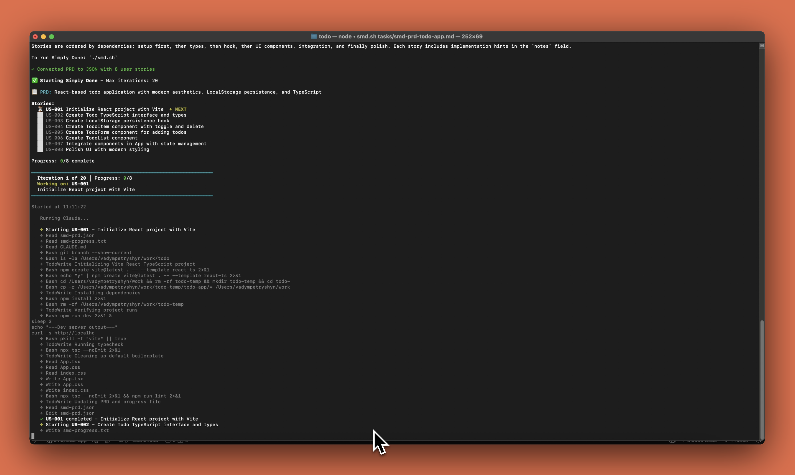

# Simply Done



> An autonomous AI agent loop that runs Claude Code repeatedly until all PRD items are complete.

Each iteration is a fresh Claude instance with clean context. Memory persists via **git history**, **smd-progress.txt**, and **smd-prd.json**.

Based on [Geoffrey Huntley's Ralph pattern](https://ghuntley.com/ralph)

There are ready-to-use solutions like GSD, but they feel overcomplicated for my needs. I wanted something simple that I can use for everyday work on projects of any size.

---

## How It Works

Simply Done breaks your feature into small, atomic user stories and executes them **one task per Claude session**. Each task runs in a separate session with fresh context, continuing until all acceptance criteria pass.

```
┌─────────────────────────────────────────────────────────────────┐
│  /smd-prd "your feature"  →  tasks/smd-prd-feature.md           │
│                                                                 │
│              ./smd.sh tasks/smd-prd-feature.md                  │
│                         │                                       │
│                         ▼                                       │
│              ┌─────────────────────┐                            │
│              │  Auto-convert PRD   │  (if userStories empty)    │
│              │  to smd-prd.json    │                            │
│              └─────────────────────┘                            │
│                         │                                       │
│     ┌───────────────────┼───────────────────┐                   │
│     │                   ▼                   │                   │
│     │   ┌─────────────────────────────┐     │                   │
│     │   │   Claude Session (fresh)    │     │                   │
│     │   │   • Read smd-prd.json       │     │                   │
│     │   │   • Pick next story         │     │                   │
│     │   │   • Implement + verify      │     │                   │
│     │   │   • Mark passes: true       │     │                   │
│     │   └─────────────────────────────┘     │                   │
│     │                   │                   │                   │
│     │         Loop until all done           │                   │
│     └───────────────────┴───────────────────┘                   │
└─────────────────────────────────────────────────────────────────┘
```

**Why separate sessions?**
- Fresh context prevents confusion from previous attempts
- Failed iterations don't pollute the next try
- Progress is tracked externally in `smd-prd.json` and `smd-progress.txt`
- Each story gets full context window attention

> **Note:** The script runs Claude Code with `--dangerously-skip-permissions` flag, which bypasses permission prompts for file edits and command execution.

---

## Installation

### Option 1: Let Claude Code Install It (Recommended)

Simply paste this link in Claude Code and ask it to install:

```
https://raw.githubusercontent.com/vadympetryshyn/simply-done/main/LLM-INSTALL.md
```

Example prompt:
> "Install Simply Done using this guide: https://raw.githubusercontent.com/vadympetryshyn/simply-done/main/LLM-INSTALL.md"

Claude will automatically clone the repo, copy the skills, and set up everything in your project.

---

### Option 2: Manual Installation

#### 1. Copy skills to your Claude config

```bash
cp -r skills/* .claude/skills/
```

#### 2. Copy files to your project root

```bash
cp smd.sh smd-prompt.md smd-prd.json /path/to/your/project/
chmod +x /path/to/your/project/smd.sh
```

#### 3. Requirements

- [Claude Code CLI](https://docs.anthropic.com/en/docs/claude-code) installed and authenticated
- `jq` for JSON processing (`brew install jq` on macOS)
- Bash shell

#### 4. Recommended: Playwright MCP

Simply Done uses Playwright MCP to verify frontend implementations by checking the actual UI in a browser. For better quality verification of UI stories, install the [Playwright MCP server](https://github.com/anthropics/claude-code/blob/main/docs/mcp.md):

```bash
claude mcp add playwright -- npx @anthropic-ai/mcp-playwright@latest
```

Without Playwright MCP, the script will still work but won't be able to visually verify frontend changes.

---

## Usage

### Step 1: Generate a PRD using skill

```bash
/smd-prd [description of your feature, bug, task, or project]
```

This skill will:
1. **Reset** `smd-prd.json` to a clean state
2. **Research** your codebase to understand existing patterns
3. **Enter planning mode** to ask clarifying questions
4. **Generate a detailed PRD** with user stories and acceptance criteria
5. Save to `tasks/smd-prd-[feature-name].md`

**Example:**
```bash
/smd-prd Add user authentication with email/password login
```

### Step 2: Run the autonomous loop

```bash
./smd.sh tasks/smd-prd-[feature-name].md
```

The script will:
- **Auto-convert** the PRD to JSON format (if `smd-prd.json` has no user stories)
- Display all stories with their status
- Work through each story one at a time
- Show real-time progress updates
- Stage changes (but not commit — you review first)
- Stop when all stories pass or max iterations reached

**Options:**
```bash
./smd.sh tasks/smd-prd-feature.md      # Run with specific PRD file
./smd.sh tasks/smd-prd-feature.md 50   # Custom: 50 iterations
./smd.sh                                # Interactive file selector
./smd.sh 50                             # File selector + custom iterations
```

---

## File Structure

```
your-project/
├── smd.sh             # The autonomous loop script
├── smd-prompt.md      # Instructions for each Claude session
├── smd-prd.json       # Current PRD in structured format
├── smd-progress.txt   # Learnings and notes between sessions
├── tasks/             # PRD markdown files
│   └── smd-prd-*.md
└── archive/           # Completed runs (auto-archived)
    └── YYYY-MM-DD-feature-name/
```

---

## Tips

1. **Write clear acceptance criteria** — vague criteria like "works correctly" cause failures
2. **Keep stories small** — if Claude runs out of context, the story is too big
3. **Check smd-progress.txt** — learnings accumulate and help future iterations
4. **Review before committing** — Simply Done stages but doesn't commit, giving you control

---

## Troubleshooting

**Simply Done keeps failing on the same story:**
- The story might be too large — split it into smaller pieces
- Check `smd-progress.txt` for error patterns
- Review `.smd-output.log` for full Claude output

**Context window exhausted:**
- Story is too ambitious — break it down
- Too many files being read — add specific file paths to notes

**Stories completed but not working:**
- Acceptance criteria may be too vague
- Add "Verify visually in browser" for UI stories

**Claude gets stuck, loops, or goes in a wrong direction:**
- Press `Ctrl+C` once to abort the current iteration and start a fresh one
- Press `Ctrl+C` twice quickly to exit the script completely
- Simply run `./smd.sh` again to resume from where you left off
- All progress is saved in `smd-prd.json` — completed stories stay marked as `passes: true`

**Bugs found after completion:**
- For a few small bugs: Fix them in a regular Claude Code session. Mention `smd-progress.txt` so Claude understands what was done, then describe what needs to be fixed
- For many bugs: Run `/smd-prd` describing all the issues, also mention `smd-progress.txt`, then `./smd.sh tasks/smd-prd-bugfixes.md` to fix them systematically as new user stories

---

## Roadmap

### Phase 1: Interaction
- Add opportunity to write claude during implementation

### Phase 2: Quality Assurance
- **Enhanced Acceptance Criteria Validation** — Integrate Playwright or Chrome DevTools for automated verification

### Phase 3: User Control
- **Interactive Mode** — Pause after each task for user review, allow on-the-fly fixes

### Phase 4: Performance
- **Parallel Execution Mode** — Analyze dependencies and execute independent tasks concurrently

### Phase 5: User Experience
- **Terminal UI Improvements** — Implement TUI for better visualization (progress bars, task trees, status panels)

---

## Credits

- Original idea of Ralph pattern by [Geoffrey Huntley](https://ghuntley.com/ralph)
- Inspired by: [snarktank/ralph](https://github.com/snarktank/ralph)

---

## License

MIT
